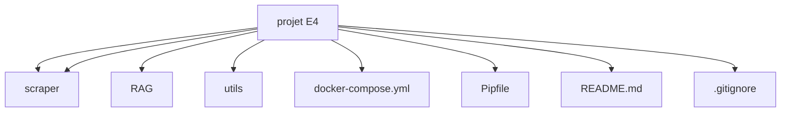

# 🧠 📊 Agent IA pour la sécurité routière – Projet RAG Multimodal

Ce projet a pour but de créer un agent intelligent capable de répondre à des questions sur la sécurité routière en France à partir de documents officiels de l’ONISR.
Il combine scraping, base de données, modèle RAG et une API Flask pour interagir avec un LLM multimodal.

L’application permet d’extraire automatiquement des rapports publics, de les analyser, d’indexer leur contenu, et de générer des réponses pertinentes en combinant texte et image (extraits de PDF).

## 🚀 Objectifs
Mettre en œuvre un système RAG (Retrieval-Augmented Generation) capable :

- D’extraire automatiquement les rapports ONISR.
- D’indexer les paragraphes dans MongoDB.
- D’interroger un LLM multimodal (texte + image).
- De proposer une réponse enrichie via API.

## 📑 Table des Matières

- [User Guide](#user-guide)
- [Architecture](#architecture)
- [Résultats attendus](#résultats-attendus)
- [Technologies](#technologies)
- [Auteurs](#auteurs)
- [Contact](#contact)


## User Guide 

### 1. Prérequis 

Avant de démarrer ce projet, assurez-vous d'avoir installé les outils suivants :

- Git afin de cloner le projet depuis le dépôt distant GitHub.

- DockerDesktop pour déployer le projet 

### 2. Installation

Commencez par cloner ce dépôt dans votre répertoire local.

Pour ce faire, ouvrez un terminal pour stocker le projet grâce à la commande :

Lorsque vous êtes dans le dossier voulu, rentrez la commande suivante :
```bash
$ git clone https://github.com/SullyvanCOULON/ProjectE4
```

⚠️ Important : Basculez sur la branche rag pour exécuter le projet correctement :
```bash
$ git checkout rag
```

### 3. Lancer le projet

Pour cette étape il vous suffit d'ouvrir le dossier avec Docker Desktop, puis vous rendre dans le bon dossier avec le terminal de Docker.

```bash
$ cd ProjetE4/
```

Une fois rendu dans le bon dossier, il ne vous reste plus qu'à taper les deux commandes suivantes pour exécuter le projet :

```bash
$ docker compose build
$ docker compose up -d
```

La première commande permet de construire le projet sur votre machine (installation des dépendances). La deuxième commande quant à elle permet de lancer le projet en allouant des conteneurs. 

Patientez ensuite jusqu'à l'apparition d'un groupe de conteneurs dans votre application Docker. Nous avons mis en place une logique d'attente entre les conteneurs pour qu'ils ne puissent pas s'exécuter tous en même temps et entrer en conflit. 

Cela lancera :
- MongoDB
- Le scraper ONISR
- Le serveur RAG avec API Flask


## Architecture

Vous trouverez ci-dessous un diagramme de l'architecture du code réalisé avec Mermaid :

## Résultats attendus

Une fois le scraping effectué avec succès, les documents récupérés depuis le site de l’ONISR sont :

- Stockés dans MongoDB sous forme structurée (titre, sous-titres, paragraphes...).
- Directement accessibles par le modèle RAG pour générer des réponses enrichies.
- Exploitables dans une logique de question/réponse texte ou image + texte.

> Exemple : *“Quelles sont les principales causes de mortalité sur la route ?”* → le modèle va chercher les paragraphes liés dans MongoDB, puis y répondre.

## Technologies
- Python 3.12
- Scrapy
- Flask
- MongoDB
- Docker / Docker Compose
- LLM multimodal (Qwen2.5 VL via serveur OpenAI-like)

<br>

## Auteurs

Nathan LECOIN 

Louka MORANDI

Sullyvan COULON

Esteban NABONNE 

ESIEE Paris – Promo E4 DSIA 2025

## Contact

nathan.lecoin@edu.esiee.fr

louka.morandi@edu.esiee.fr

sullyvan.coulon@edu.esiee.fr

esteban.nabonne@edu.esiee.fr

<br>

🎯 *Ce projet a été réalisé dans le cadre de l’UE Projet E4 – ESIEE Paris (2024-2025).*

<br>
<br>
<br>

<p align="center"><a href="#top">⬆ Retour en haut</a></p>
